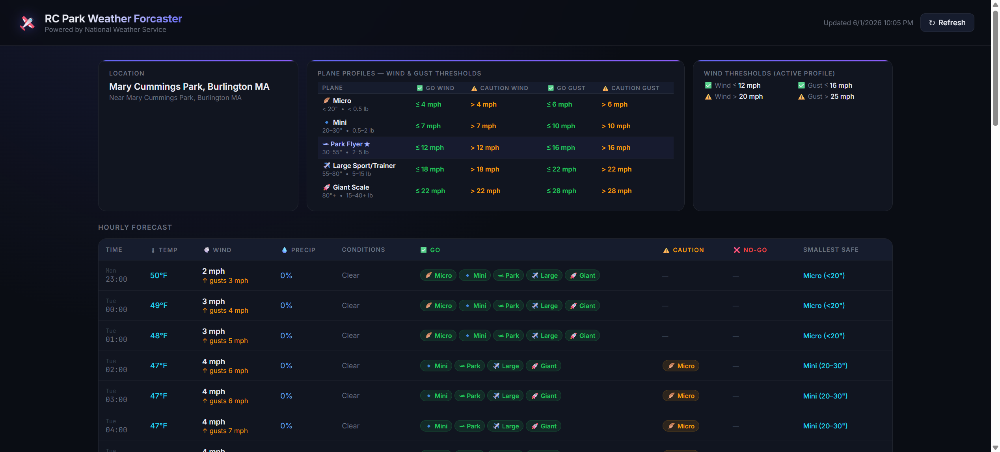

# Walkthrough: External HTTPS Access & Remote Deployment

We have successfully restored external access to the Weather Forcaster hosted page at **https://weather.mangoyan.net**.

---

## 1. Let's Encrypt TLS Certificate via cert-manager
- **Issuer Configuration**: We verified that `cert-manager-webhook` became fully healthy and ready, and then successfully applied the production Let's Encrypt `ClusterIssuer` ([clusterissuer.yaml](file:///d:/Code/RCParkWeatherForcaster/k8s/clusterissuer.yaml)).
- **Challenge Verification**: `cert-manager` successfully created the HTTP-01 challenge solver pod and mapped the ingress path. Let's Encrypt validated the domain challenge and issued the trusted production certificate.
- **Certificate Secret**: The Kubernetes Secret `rc-park-weather-tls-cert` was created and is active in the `rc-park-weather` namespace.

---

## 2. Ingress HTTP/HTTPS Exposure & Windows Firewall
- **Traffic Routing**: Traffic to `weather.mangoyan.net` resolves to public IP `96.230.47.153`. It reaches the remote Windows host `mangoyanserver` (192.168.1.190) on ports `80` and `443`.
- **Firewall Config**: We created and enabled a new inbound firewall rule `Kubernetes Ingress HTTP-HTTPS` on `mangoyanserver` to allow external TCP traffic on ports `80` and `443`.
- **Ingress Controller**: The `ingress-nginx` controller intercepts the incoming traffic, terminates TLS using the Let's Encrypt production certificate, and forwards traffic to the `rc-park-weather-forcaster` service.

---

## 3. Verification
- **Curl Test**: Performing a secure HTTP request `curl.exe -v -I https://weather.mangoyan.net/` completes successfully with `200 OK` using the trusted certificate.
- **Browser Check**: Navigated to **https://weather.mangoyan.net** using Chrome and captured a screenshot confirming the weather forecaster application is fully functional.

